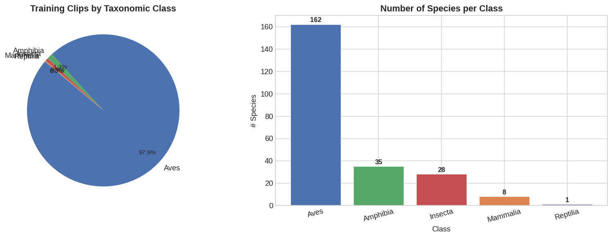
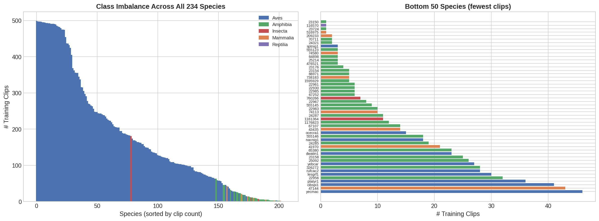
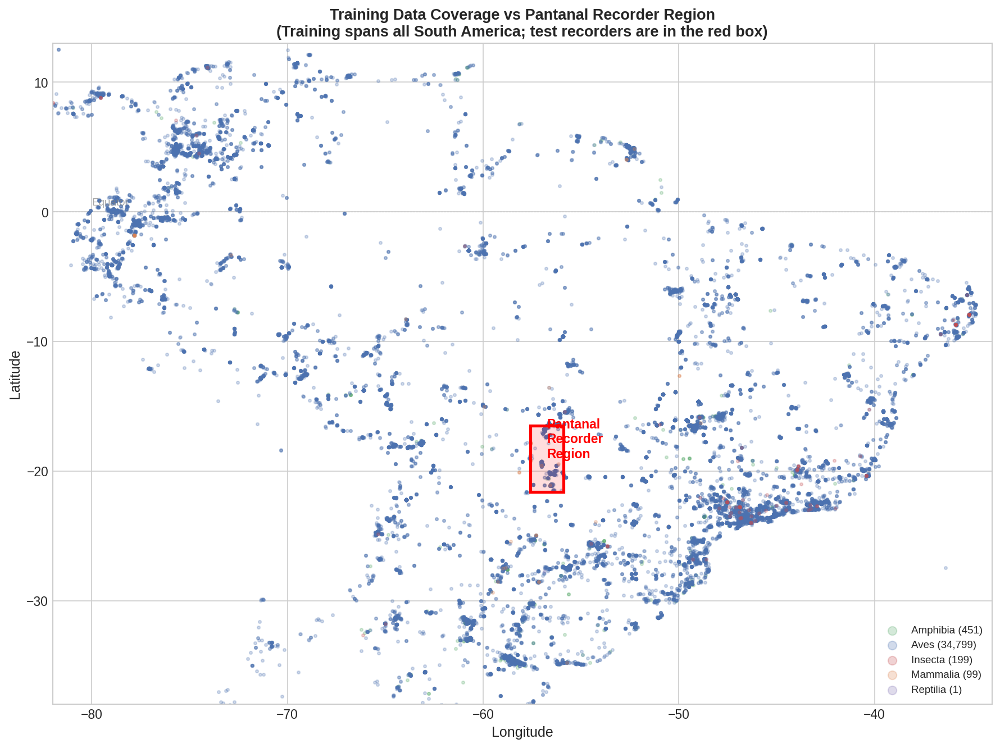
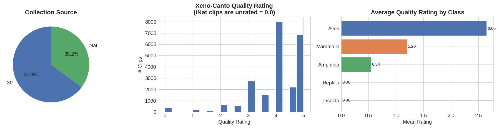
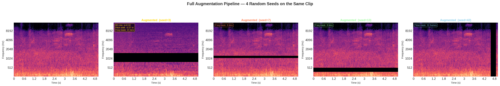
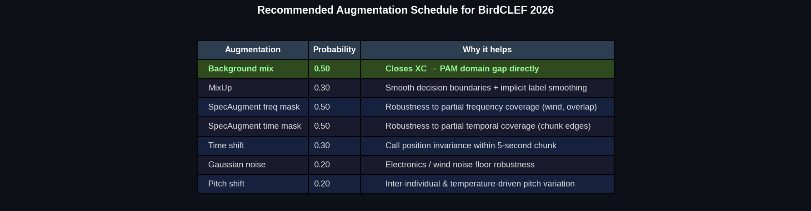

# BirdCLEF+ 2026

> Wildlife species identification from passive acoustic monitoring recordings in the **Pantanal wetlands**, Brazil.
> Kaggle code competition — metric: **macro ROC-AUC** — deadline: **June 3, 2026**

---

## Project Scope

This repository contains a full end-to-end pipeline for the [BirdCLEF+ 2026](https://www.kaggle.com/competitions/birdclef-2026) competition, built around two goals:

1. **Win the competition** — systematic model improvements from baseline EfficientNet-B0 through multi-round pseudo-labeling and ensemble
2. **Didactic Kaggle notebooks** — each notebook is written to be educational first, targeting upvotes alongside a competitive score

The competition requires identifying **234 wildlife species** (birds, insects, amphibians, mammals, reptiles) from continuous PAM recordings deployed across ~1,000 recorders in the Pantanal.

Key novelties vs. prior BirdCLEF editions:
- **Multi-taxa**: birds + insects + amphibians + mammals + reptiles
- **Scale**: ~1,000 passive acoustic recorders running continuously
- **New region**: Pantanal (Brazil) — entirely different species distribution from 2025 (Colombia)
- **Labeled soundscapes**: expert-annotated segments from real PAM recordings — primary data for some species

---

## Dataset Overview

| Metric | Value |
|---|---|
| Total training clips | 35,549 |
| Species | 234 |
| Training soundscapes | 10,658 |
| Expert-labeled soundscape segments | 1,478 |
| Recorder region | Lat −21.6→−16.5, Lon −57.6→−55.9 (Pantanal) |
| Audio format | OGG, 32 kHz |

### Taxa breakdown

| Class | Species | Clips |
|---|---|---|
| Aves (birds) | 162 | 34,799 |
| Amphibia | 35 | 451 |
| Insecta | 28 | 199 |
| Mammalia | 8 | 99 |
| Reptilia | 1 | 1 |

| Source | Clips |
|---|---|
| Xeno-canto (XC) | 23,043 |
| iNaturalist (iNat) | 12,506 |

---

## Visualizations

### Taxa and class distribution



*Birds dominate the training data (98% of clips). Non-bird taxa — especially insects and the single Caiman clip — are learned primarily from the 1,478 expert-labeled soundscape segments.*

### Class imbalance (long-tail)



*The distribution is heavily long-tailed. The top species has ~500+ clips; dozens of species have fewer than 10. Pseudo-labeling on unlabeled soundscapes is mandatory to improve rare-class recall.*

### Geographic domain shift



*Training clips come from all of South America (XC/iNat community recordings). Test recorders are confined to a 5°×2° Pantanal box. Background mix augmentation — mixing training clips with unlabeled Pantanal soundscapes — directly bridges this gap.*

### Recording quality



*Xeno-canto clips have quality ratings 1–5. iNaturalist clips are unrated (shown as 0). Sample weighting by quality (Gold=1.0, XC≥3=0.8, XC<3=0.5, iNat=0.4) prevents noisy recordings from dominating training.*

### Augmentation pipeline



*Four random augmentation seeds applied to the same original clip. The stochastic pipeline (background mix → time shift → pitch shift → SpecAugment) produces diverse training examples from a single recording.*



---

## Inference Benchmarks

Tested locally on CPU (EfficientNet-B0, input shape `1×128×501`):

| Backend | ms / 5s chunk | Speedup | 12,000 chunks |
|---|---|---|---|
| PyTorch CPU | 42 ms | 1× | ~8.4 min |
| ONNX Runtime | 18 ms | 2.4× | ~3.5 min |
| OpenVINO FP16 | ~5 ms* | ~8-12×* | ~1 min* |

*OpenVINO estimate based on prior BirdCLEF editions; not yet measured locally.*

The competition runs inference on Kaggle CPU with a ~90-120 min total budget. All models are exported to ONNX and converted to OpenVINO FP16 before the final submission.

---

## Pipeline Architecture

```
Training data
├── train_audio/         (35,549 clips, XC + iNat)
├── train_soundscapes/   (10,658 PAM recordings)
└── train_soundscapes_labels.csv  (1,478 expert segments)
         │
         ▼
  ┌──────────────────────────────────────────┐
  │            Two-Pipeline Architecture     │
  │                                          │
  │  Bird pipeline (162 classes)             │
  │  ├── EfficientNet-B1/B3/B4               │
  │  ├── RegNetY-016                         │
  │  └── BirdNET pretrained (9K species)     │
  │                                          │
  │  Non-bird pipeline (72 classes)          │
  │  ├── ECA-NFNet-L0  (Focal BCE)           │
  │  └── Primary data: soundscape gold segs  │
  └──────────────────────────────────────────┘
         │
         ▼
  Pseudo-labeling (4 rounds)
  ├── Voters: B4 + EVA-02 Large + DINOv2-Large
  ├── 2-of-3 consensus, rarity-stratified thresholds
  └── Power scaling: p^0.7
         │
         ▼
  Ensemble (rank averaging)
  └── OpenVINO FP16 → submission CSV
```

**ViTs (EVA-02, DINOv2) are used for pseudo-label generation only** — they produce superior pseudo-labels but are too slow (~8-15s/chunk on CPU) for competition inference.

---

## Notebooks

| # | Notebook | Purpose | GPU |
|---|---|---|---|
| 01 | [EDA](kaggle_notebooks/01_eda_birdclef2026.py) | Taxa breakdown, class imbalance, geographic domain shift, data quality | No |
| 02 | [Spectrogram Guide](kaggle_notebooks/02_spectrogram_guide.py) | Waveform→STFT→mel pipeline, parameter sweep, multi-taxa gallery | No |
| 03 | [EfficientNet-B0 Baseline](kaggle_notebooks/03_baseline_efficientnet.py) | Full training pipeline, 5-fold CV, soundscape inference, ONNX export | Yes |
| 04 | [Augmentation Showcase](kaggle_notebooks/04_augmentation_showcase.py) | SpecAugment, MixUp, background mix, time shift, pitch shift — visual demos | No |
| 05 | [OpenVINO Inference](kaggle_notebooks/05_inference_openvino.py) | PyTorch→ONNX→OpenVINO export, CPU benchmark, budget planning | No |
| 06 | [Backbone Search](kaggle_notebooks/06_backbone_search.py) | B1/B3/B4/RegNetY/NFNet, BCE loss, GroupKFold by site | Yes |
| 07 | [BirdNET Fine-tune](kaggle_notebooks/07_birdnet_finetune.py) | 2-phase fine-tuning of BirdNET pretrained weights | Yes |
| 08 | [Non-Bird Pipeline](kaggle_notebooks/08_nonbird_pipeline.py) | Focal BCE, soundscape gold segments, insect sonotypes | Yes |
| 09 | [Pseudo-Labeling](kaggle_notebooks/09_pseudo_labeling.py) | 2-of-3 consensus PL, rarity thresholds, power scaling | GPU |
| 10 | [ViT PL Generator](kaggle_notebooks/10_vit_pl_generator.py) | EVA-02 Large / DINOv2 fine-tune for PL diversity | Heavy |
| 11 | [Final Ensemble](kaggle_notebooks/11_ensemble.py) | Rank-avg bird + weighted non-bird, OpenVINO, submission | No |

---

## Strategy Summary

Based on analysis of 2024 and 2025 winning solutions:

| Component | Choice | Rationale |
|---|---|---|
| Loss | BCE (bird), Focal BCE (non-bird) | Test chunks are multi-label; Focal handles Caiman (1 clip) |
| Backbone | EfficientNet-B1/B3/B4 + RegNetY-016 | Consistent winners 2024–2025 |
| Validation | GroupKFold by recorder site | Prevents acoustic site leakage in CV |
| Key augmentation | Background mix (p=0.5) | Closes domain gap between XC clips and Pantanal PAM |
| Pseudo-labeling | 4 rounds, 2-of-3 vote, power scaling p^0.7 | Mandatory for top-5; power scaling prevents error amplification |
| Inference | OpenVINO FP16 | ~8-12× CPU speedup; all top teams used it |

Full strategy document: [docs/plans/2026-03-12-winning-strategy-design.md](docs/plans/2026-03-12-winning-strategy-design.md)

---

## Experiment Log

| ID | Model | Backbone | PL round | CV AUC | LB AUC | Notes |
|---|---|---|---|---|---|---|
| exp001 | baseline | EfficientNet-B0 | 0 | TBD | TBD | 10ep, CrossEntropy, StratifiedKFold |

---

## Audio Processing Constants

```python
SR          = 32000   # sample rate
N_FFT       = 1024
HOP_LENGTH  = 320
N_MELS      = 128
FMIN        = 40      # Hz
FMAX        = 15000   # Hz
DURATION    = 5       # seconds (inference)
TRAIN_DURATION = 10   # seconds (training — longer context helps)
```

---

## References

- [BirdCLEF+ 2026 — Kaggle](https://www.kaggle.com/competitions/birdclef-2026)
- [2025 1st Place Solution (Nikita Babych)](https://www.kaggle.com/competitions/birdclef-2025/writeups/nikita-babych-1st-place-solution-multi-iterative-n)
- [2025 2nd Place Solution (VSydorskyy)](https://github.com/VSydorskyy/BirdCLEF_2025_2nd_place)
- [BirdNET-Analyzer](https://github.com/kahst/BirdNET-Analyzer)

---

*Author: Alexy Louis · Competition deadline: June 3, 2026*
