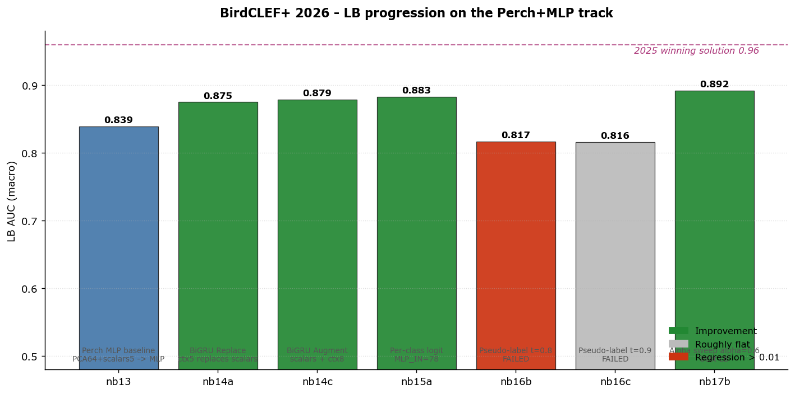
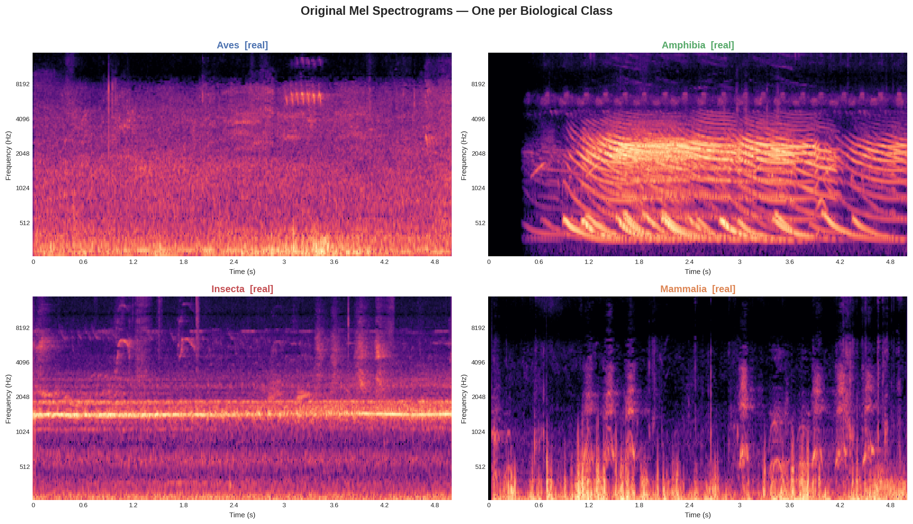
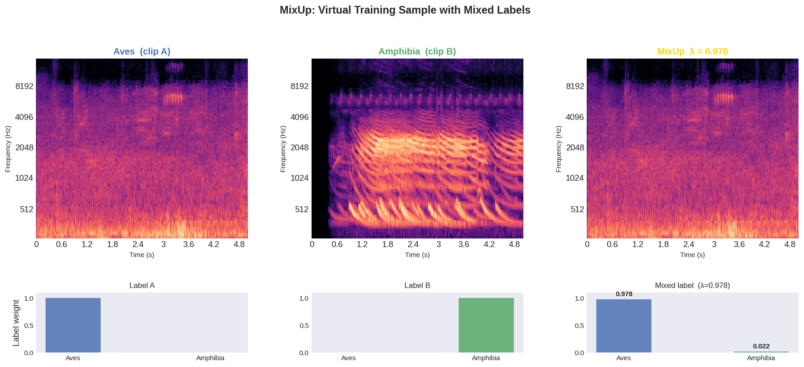
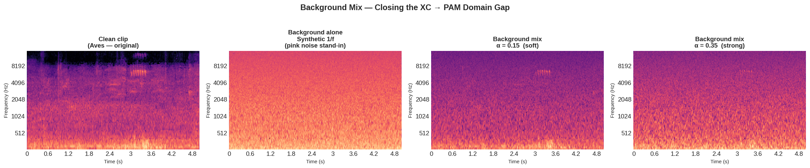
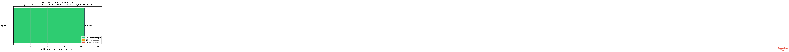
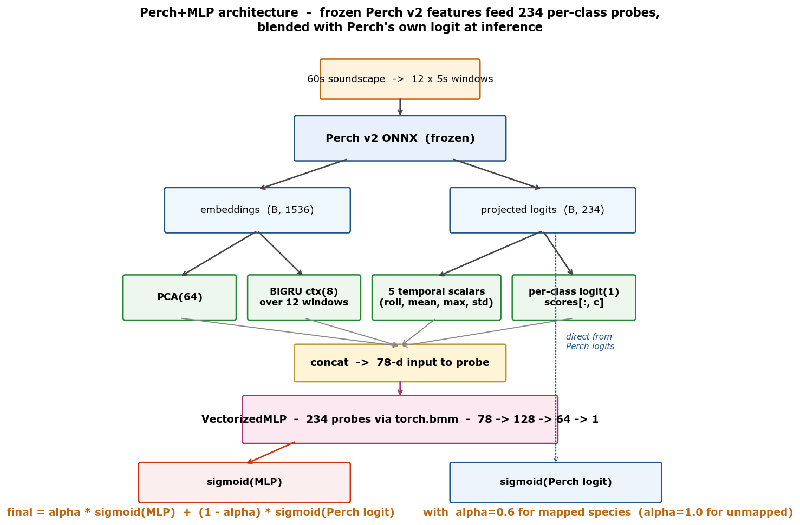
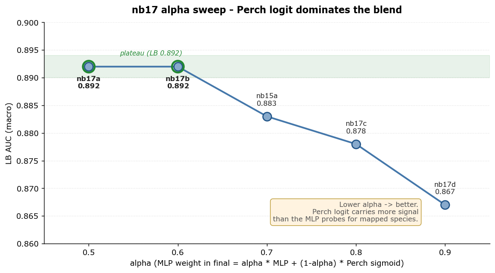

# BirdCLEF+ 2026

> Wildlife species identification from passive acoustic monitoring recordings in the **Pantanal wetlands**, Brazil.
> Kaggle code competition — metric: **macro ROC-AUC** — deadline: **June 3, 2026**

**Current best LB: 0.892** ([nb17b](kaggle_notebooks/17b_alpha_sweep_06.py) — Perch v2 ONNX + per-class MLP probes + α=0.6 blend)

---

## Project Scope

This repository contains a full end-to-end pipeline for the [BirdCLEF+ 2026](https://www.kaggle.com/competitions/birdclef-2026) competition, built around two goals:

1. **Win the competition** — systematic model improvements toward the historical winning band (LB 0.93+)
2. **Didactic Kaggle notebooks** — each notebook is written to be educational first, targeting upvotes alongside a competitive score

The competition requires identifying **234 wildlife species** (birds, insects, amphibians, mammals, reptiles) from continuous PAM recordings deployed across ~1,000 recorders in the Pantanal.

Key novelties vs. prior BirdCLEF editions:
- **Multi-taxa**: birds + insects + amphibians + mammals + reptiles
- **Scale**: ~1,000 passive acoustic recorders running continuously
- **New region**: Pantanal (Brazil) — entirely different species distribution from 2025 (Colombia)
- **Labeled soundscapes**: expert-annotated segments from real PAM recordings — primary data for some species

---

## Progress at a Glance



The current path (nb13 → nb17b) is the **Perch+MLP track**: Google's Perch v2 audio foundation model used as a frozen feature extractor, with small per-class MLP probes trained on the 66 labeled soundscapes (792 windows). This shortcut path got us to LB 0.892 in 7 notebooks. The pseudo-labeling round (nb16) failed — a useful negative result, see [§ Key Findings](#key-findings).

**Next direction (in flight):** [nb18](kaggle_notebooks/18a_cnn_efficientnet_b0.py) opens a parallel CNN baseline track (EfficientNet-B0/B3/RegNetY-008 trained from scratch on mel spectrograms) — historically the +0.03 to +0.05 lever in 2024/2025.

---

## Dataset Overview

| Metric | Value |
|---|---|
| Total training clips | 35,549 |
| Species | 234 |
| Training soundscapes | 10,658 |
| Expert-labeled soundscape segments | 1,478 |
| Recorder region | Lat −21.6→−16.5, Lon −57.6→−55.9 (Pantanal) |
| Audio format | OGG, 32 kHz |

### Taxa breakdown

| Class | Species | Clips |
|---|---|---|
| Aves (birds) | 162 | 34,799 |
| Amphibia | 35 | 451 |
| Insecta | 28 | 199 |
| Mammalia | 8 | 99 |
| Reptilia | 1 | 1 |

| Source | Clips |
|---|---|
| Xeno-canto (XC) | 23,043 |
| iNaturalist (iNat) | 12,506 |

---

## Visualizations

### Taxa and class distribution


*Birds dominate the training data (98% of clips). Non-bird taxa — especially insects and the single Caiman clip — are learned primarily from the 1,478 expert-labeled soundscape segments.*

### Class imbalance (long-tail)


*The distribution is heavily long-tailed. The top species has ~500+ clips; dozens of species have fewer than 10. Pseudo-labeling on unlabeled soundscapes is mandatory to improve rare-class recall.*

### Geographic domain shift


*Training clips come from all of South America (XC/iNat community recordings). Test recorders are confined to a 5°×2° Pantanal box. Background mix augmentation — mixing training clips with unlabeled Pantanal soundscapes — directly bridges this gap.*

### Recording quality


*Xeno-canto clips have quality ratings 1–5. iNaturalist clips are unrated (shown as 0). Sample weighting by quality (Gold=1.0, XC≥3=0.8, XC<3=0.5, iNat=0.4) prevents noisy recordings from dominating training.*

### Augmentation pipeline

**Original spectrograms (one per taxa):**



**MixUp** — blends two species clips; labels are mixed proportionally (λ·label_A + (1-λ)·label_B):



**Background mix** — the highest-ROI augmentation: training clips mixed with real Pantanal soundscape noise, directly closing the domain gap:



**Full stochastic pipeline** — four random seeds on the same clip:


---

## Inference Benchmarks

Measured on **Kaggle CPU** (EfficientNet-B0, input shape `1×128×501`, n=50 runs):

| Backend | ms / 5s chunk | Speedup | 12,000 chunks | Status |
|---|---|---|---|---|
| PyTorch CPU | 41.9 ms | 1× | ~8.4 min | ✅ measured |
| ONNX Runtime | ~17 ms* | ~2.4×* | ~3.5 min* | ⏳ pending |
| OpenVINO FP16 | ~5 ms** | ~8-12×** | ~1 min** | ⏳ pending |

*Local CPU measurement. **Estimate from prior BirdCLEF editions (2024–2025 winners). Full ONNX/OpenVINO numbers will be added once pip install cell is enabled.*



*PyTorch CPU baseline (42 ms/chunk) is well within the 450 ms/chunk budget. ONNX Runtime and OpenVINO FP16 will push this even further down, leaving headroom for a 5-model ensemble.*

The competition runs inference on Kaggle CPU with a ~90-120 min total budget. All models are exported to ONNX and converted to OpenVINO FP16 before the final submission.

---

## Pipeline Architecture (current best: nb17b, LB 0.892)



The current path uses **Google Perch v2** as a frozen feature extractor and trains tiny per-class probes on top:

- **Inputs**: each 60s soundscape → 12 × 5s windows
- **Perch v2 ONNX** (frozen) → 1536-dim embeddings + 234-dim projected logits per window
- **PCA** → 64-dim compressed embedding
- **BiGRU** over the 12 windows → 8-dim temporal context
- **Per-class logit feature** → 1 scalar per probe (Perch's own logit for that species)
- **5 hand-crafted scalars** → roll, mean, max, std per window
- **VectorizedMLP**: 234 parallel probes (one per species), input 78-dim → 128 → 64 → 1, implemented via `torch.bmm` for efficiency
- **Alpha-blend** at submission: `final = α · sigmoid(MLP) + (1-α) · sigmoid(Perch_logit)` for mapped species; `α=1.0` (MLP only) for unmapped species (insect sonotypes, etc.)

The nb17 alpha sweep showed that **lower α is better** — Perch's logit carries more signal than the MLP probes for mapped species. The MLP is best understood as a *correction layer* on top of Perch, not an independent predictor.

### Pipeline diagram (original CNN plan — pending in nb18)

The original March 2026 strategy targeted a CNN ensemble (EfficientNet-B0/B3 + RegNetY + BirdNET + multi-round pseudo-labeling). We bypassed that for the faster Perch+MLP path above, and are now **opening it as a parallel track** in nb18a/b/c.

```
Training data
├── train_audio/         (35,549 clips, XC + iNat)
├── train_soundscapes/   (10,658 PAM recordings, 66 labeled)
└── train_soundscapes_labels.csv  (1,478 expert segments)
         │
         ▼
  ┌──────────────────────────────────────────┐
  │       nb18 - parallel CNN track          │
  │  EfficientNet-B0  / B3  / RegNetY-008    │
  │  Mel spec (n_mels=128, SR=32k)           │
  │  Background mix + SpecAug + MixUp        │
  │  5-fold CV, AdamW + cosine               │
  └──────────────────────────────────────────┘
         │
         ▼
  nb19 - ensemble Perch+MLP × CNN
         │
         ▼
  OpenVINO FP16 -> submission CSV
```

---

## Notebooks

### Foundation (didactic, March–April 2026)

| # | Notebook | Purpose | GPU |
|---|---|---|---|
| 01 | [EDA](kaggle_notebooks/01_eda_birdclef2026.py) | Taxa breakdown, class imbalance, geographic domain shift, data quality | No |
| 02 | [Spectrogram Guide](kaggle_notebooks/02_spectrogram_guide.py) | Waveform→STFT→mel pipeline, parameter sweep, multi-taxa gallery | No |
| 03 | [EfficientNet-B0 Baseline](kaggle_notebooks/03_baseline_efficientnet.py) | Full training pipeline, 5-fold CV, soundscape inference, ONNX export | Yes |
| 04 | [Augmentation Showcase](kaggle_notebooks/04_augmentation_showcase.py) | SpecAugment, MixUp, background mix — visual demos | No |
| 05 | [OpenVINO Inference](kaggle_notebooks/05_inference_openvino.py) | PyTorch→ONNX→OpenVINO export, CPU benchmark, budget planning | No |

### Perch+MLP track (May 2026 — LB 0.839 → 0.892)

| # | Notebook | Purpose | LB |
|---|---|---|---|
| 13 | [Perch MLP Baseline](kaggle_notebooks/13_perch_mlp_baseline.py) | Perch v2 ONNX embeddings + PCA + 234 MLP probes | **0.839** |
| 14a | [BiGRU Replace](kaggle_notebooks/14a_bigru_replace.py) | BiGRU temporal context replaces hand-crafted scalars | 0.875 |
| 14c | [BiGRU Augment](kaggle_notebooks/14c_bigru_augment.py) | BiGRU ctx **appended** to scalars (MLP_IN=77) | 0.879 |
| 15a | [Per-class logit + blend](kaggle_notebooks/15a_logit_cls_blend.py) | Each species' Perch logit added as a probe input (MLP_IN=78) | **0.883** |
| 15b–f | Logit variants 2×3 matrix | Global PCA-32 ctx, blend ON/OFF combinations | 0.502–0.864 |
| 16 | [Pseudo-label pipeline](kaggle_notebooks/16_pseudo_label_saver.py) (saver + 3 thresholds) | 127,104 windows on `unlabeled_soundscapes/` | **FAILED (0.502–0.817)** |
| 17a–d | [Alpha sweep](kaggle_notebooks/17b_alpha_sweep_06.py) (0.5, 0.6, 0.8, 0.9) | Calibration diagnostic on the blend weight | **0.892** (α=0.5 or 0.6) |

### CNN track (in flight)

| # | Notebook | Purpose | Status |
|---|---|---|---|
| 18a | [EfficientNet-B0 from scratch](kaggle_notebooks/18a_cnn_efficientnet_b0.py) | Mel spec → CNN, 5-fold CV, BCE multi-label | Pending |
| 18b | [EfficientNet-B3](kaggle_notebooks/18b_cnn_efficientnet_b3.py) | Same as 18a, larger backbone | Pending |
| 18c | [RegNetY-008](kaggle_notebooks/18c_cnn_regnety_008.py) | Architectural diversity for ensemble | Pending |

Each notebook is implemented in a separate Claude Code session using the implementation briefs at `docs/plans/nbXX-implementation.md` — these contain the full architecture, kernel metadata, and push workflow so a fresh session has zero context dependency.

---

## Key Findings

### Alpha sweep (nb17) — the most informative result so far



Sweeping the blend weight `α` in `final = α·MLP + (1-α)·Perch_sigmoid` showed:
- **Monotonic gradient**: lower α → better LB
- **Plateau at α ∈ [0.5, 0.6]** at LB 0.892 (+0.009 over the α=0.7 default in nb15a)
- **0.025 spread** across the 4 sweep values, well above the 0.01 threshold that justifies a learnable per-class α in nb19

The architectural reframe: the MLP is a *correction layer* on top of Perch, not an independent predictor. Perch's projected logits already carry more signal than our small probes can reproduce; the MLP's value is in conditionally re-weighting Perch outputs per species, not predicting from scratch.

### Pseudo-labeling (nb16) — a useful negative result

Running the trained nb15a model on the 127,104 windows in `unlabeled_soundscapes/` and re-training with thresholded soft labels **hurt LB by 6.6 points**:

| Threshold | LB | Δ vs nb15a |
|---|---|---|
| 0.6 | 0.502 | −0.381 |
| 0.8 | 0.817 | −0.066 |
| 0.9 | 0.816 | −0.067 |

Even threshold 0.9 (selecting only the highest-confidence windows) regressed by the same amount as threshold 0.8 — telling us this is **systematic bias**, not noise. The pseudo-labels confidently reinforce whatever the model already believes, not the truth. Naive PL on `unlabeled_soundscapes/` is a dead end with this architecture; future weak-supervision work must use a different mechanism (e.g., Perch logits directly as weak labels, or per-class agreement filters).

### OOF on 66 labeled soundscapes is an unreliable proxy for LB

Multiple times we saw OOF AUC move in the opposite direction from LB:
- nb15c: OOF +0.034 vs nb14c, LB −0.015
- nb16: high OOF on retrained models, LB collapsed

With only 792 windows in validation, the OOF distribution is too narrow to reflect generalisation to the test set. Decisions must be made on LB, not OOF, until we have access to more labeled data.

---

## Strategy Summary

Original strategy (from analysis of 2024–2025 winning solutions):

| Component | Choice | Rationale |
|---|---|---|
| Loss | BCE (bird), Focal BCE (non-bird) | Test chunks are multi-label; Focal handles Caiman (1 clip) |
| Backbone | EfficientNet-B0/B3 + RegNetY-008 (nb18) | Consistent winners 2024–2025 |
| Validation | GroupKFold by file/site | Prevents acoustic site leakage in CV |
| Key augmentation | Background mix (p=0.5) | Closes domain gap between XC clips and Pantanal PAM |
| Inference | OpenVINO FP16 | ~8-12× CPU speedup; all top teams used it |

Full strategy document: [docs/plans/2026-03-12-winning-strategy-design.md](docs/plans/2026-03-12-winning-strategy-design.md)

Per-notebook implementation briefs (used to spin up fresh sessions):
- [nb16 implementation](docs/plans/nb16-implementation.md) — pseudo-labeling two-kernel design
- [nb17 implementation](docs/plans/nb17-implementation.md) — alpha sweep
- [nb18 implementation](docs/plans/nb18-implementation.md) — CNN backbone sweep

---

## Experiment Log

| ID | Date | Track | Notebook | OOF AUC | LB AUC | Notes |
|---|---|---|---|---|---|---|
| exp004 | 2026-05-07 | Perch+MLP | nb13 | 0.64 | **0.839** | Baseline: PCA(64) + 5 scalars + 234 probes; α=0.7 blend |
| exp005 | 2026-05-07 | Perch+MLP | nb14a | 0.5222 | 0.875 | BiGRU(hidden=32) ctx replaces hand-crafted scalars |
| exp006 | 2026-05-07 | Perch+MLP | nb14c | 0.5049 | 0.879 | BiGRU ctx **appended** to scalars (MLP_IN=77) |
| exp007 | 2026-05-08 | Perch+MLP | nb15a | 0.5045 | **0.883** | Per-class Perch logit added as probe input (MLP_IN=78) |
| exp008 | 2026-05-08 | Perch+MLP | nb15c | 0.5386 | 0.864 | Global PCA-32 logit ctx — OOF +0.034, LB −0.015: overfit signal |
| exp009 | 2026-05-08 | Perch+MLP | nb15f | 0.5121 | 0.502 | Blend OFF (MLP only) — confirms blend is essential |
| exp010 | 2026-05-09 | Perch+MLP | nb16b | n/a | 0.817 | Pseudo-label threshold 0.8 — FAILED |
| exp011 | 2026-05-09 | Perch+MLP | nb16c | n/a | 0.816 | Pseudo-label threshold 0.9 — FAILED (systematic bias confirmed) |
| exp012 | 2026-05-11 | Perch+MLP | nb17a | n/a | **0.892** | Alpha sweep α=0.5 — tied best |
| exp013 | 2026-05-11 | Perch+MLP | nb17b | n/a | **0.892** | Alpha sweep α=0.6 — tied best, promoted to baseline |
| exp014 | 2026-05-11 | Perch+MLP | nb17c | n/a | 0.878 | Alpha sweep α=0.8 — confirms lower-α is better |
| exp015 | 2026-05-11 | Perch+MLP | nb17d | n/a | 0.867 | Alpha sweep α=0.9 — near MLP-only regresses |
| exp016 | _pending_ | CNN | nb18a | — | — | EfficientNet-B0 from scratch (parallel track) |

---

## Audio Processing Constants

```python
SR          = 32000   # sample rate
N_FFT       = 1024
HOP_LENGTH  = 320
N_MELS      = 128
FMIN        = 40      # Hz
FMAX        = 15000   # Hz
DURATION    = 5       # seconds (inference)
TRAIN_DURATION = 10   # seconds (training — longer context helps)
```

---

## References

- [BirdCLEF+ 2026 — Kaggle](https://www.kaggle.com/competitions/birdclef-2026)
- [2025 1st Place Solution (Nikita Babych)](https://www.kaggle.com/competitions/birdclef-2025/writeups/nikita-babych-1st-place-solution-multi-iterative-n)
- [2025 2nd Place Solution (VSydorskyy)](https://github.com/VSydorskyy/BirdCLEF_2025_2nd_place)
- [BirdNET-Analyzer](https://github.com/kahst/BirdNET-Analyzer)

---

*Author: Alexy Louis · Competition deadline: June 3, 2026*
